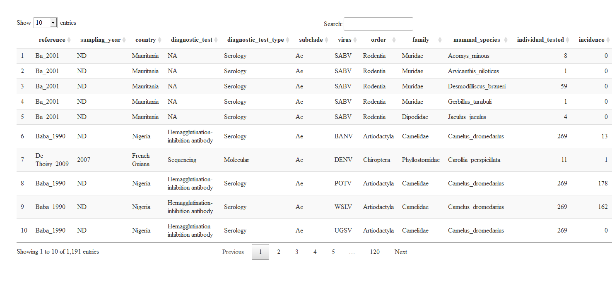

<!-- README.md is generated from README.Rmd. Please edit that file -->

# ecointeraction

<!-- badges: start -->
<!-- badges: end -->

This is ecointeraction package. The main goal is provide tools to model
and potential interactions given known interactions and predict unknown
interactions based, but not limited, on phylogenetic, environmental and
geographic distance among the host.

## Installation

You can install the development version of ecointeraction from
[GitHub](https://github.com/alrobles/ecointeraction) with:

``` r
# install.packages("devtools")
devtools::install_github("alrobles/ecointeraction")
```

## Example

We explore a raw data base of mammal virus.

``` r
library(ecointeraction)
DT::datatable(mammalvirus)
```



| reference | sampling_year | country    | diagnostic_test                      | diagnostic_test_type | subclade | virus | order        | family    | mammal_species         | individual_tested | incidence |
|:----------|:--------------|:-----------|:-------------------------------------|:---------------------|:---------|:------|:-------------|:----------|:-----------------------|------------------:|----------:|
| Ba_2001   | ND            | Mauritania | NA                                   | Serology             | Ae       | SABV  | Rodentia     | Muridae   | Acomys_minous          |                 8 |         0 |
| Ba_2001   | ND            | Mauritania | NA                                   | Serology             | Ae       | SABV  | Rodentia     | Muridae   | Arvicanthis_niloticus  |                 1 |         0 |
| Ba_2001   | ND            | Mauritania | NA                                   | Serology             | Ae       | SABV  | Rodentia     | Muridae   | Desmodilliscus_braueri |                59 |         0 |
| Ba_2001   | ND            | Mauritania | NA                                   | Serology             | Ae       | SABV  | Rodentia     | Muridae   | Gerbillus_tarabuli     |                 1 |         0 |
| Ba_2001   | ND            | Mauritania | NA                                   | Serology             | Ae       | SABV  | Rodentia     | Dipodidae | Jaculus_jaculus        |                 4 |         0 |
| Baba_1990 | ND            | Nigeria    | Hemagglutination-inhibition antibody | Serology             | Ae       | BANV  | Artiodactyla | Camelidae | Camelus_dromedarius    |               269 |        13 |

We use the function accumulate_incidence

``` r
library(ecointeraction)
ecointeraction::accumulate_incidence(data = mammalvirus, group = mammal_species, incidence = incidence)
#> # A tibble: 218 x 4
#>       id mammal_species         incidence cummulativesum
#>    <int> <chr>                      <dbl>          <dbl>
#>  1     1 Camelus_dromedarius          510            510
#>  2     2 Sus_scrofa                   336            846
#>  3     3 Alouatta_caraya              301           1147
#>  4     4 Odocoileus_virginianus       262           1409
#>  5     5 Procyon_lotor                217           1626
#>  6     6 Sciurus_carolinensis         183           1809
#>  7     7 Tadarida_brasiliensis        180           1989
#>  8     8 Choloepus_hoffmanni          176           2165
#>  9     9 Arvicanthis_niloticus        168           2333
#> 10    10 Sciurus_niger                160           2493
#> # ... with 208 more rows
#> # i Use `print(n = ...)` to see more rows
```

``` r
summary(cars)
#>      speed           dist       
#>  Min.   : 4.0   Min.   :  2.00  
#>  1st Qu.:12.0   1st Qu.: 26.00  
#>  Median :15.0   Median : 36.00  
#>  Mean   :15.4   Mean   : 42.98  
#>  3rd Qu.:19.0   3rd Qu.: 56.00  
#>  Max.   :25.0   Max.   :120.00
```

You’ll still need to render `README.Rmd` regularly, to keep `README.md`
up-to-date. `devtools::build_readme()` is handy for this. You could also
use GitHub Actions to re-render `README.Rmd` every time you push. An
example workflow can be found here:
<https://github.com/r-lib/actions/tree/v1/examples>.

You can also embed plots, for example:


In that case, don’t forget to commit and push the resulting figure
files, so they display on GitHub and CRAN.
